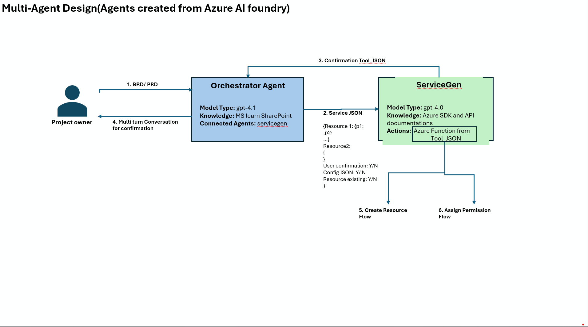

# AzureGigLab
Automate the Freelance Tech work end to end from Assessment, Onboarding, resource Allocation and Project management using agents

## Multi-Agent Architecture with Azure AI Foundry

This project implements a sophisticated multi-agent system using Azure AI Foundry to automate freelance technology work. The architecture consists of two primary AI agents working in coordination:

*Figure: Multi-Agent Architecture showing Orchestrator Agent and ServiceGen Agent workflow*

### Agent Architecture Overview

#### 1. Orchestrator Agent
- **Model Type**: GPT-4.1
- **Knowledge Base**: Microsoft Teams SharePoint integration
- **Connected Agents**: ServiceGen (configured through Azure AI Foundry's agent connectivity framework)
- **Tool Configuration**: 
  - Custom confirmation tools for user interaction
  - JSON schema validation tools
  - Multi-turn conversation management tools
- **Primary Functions**:
  - Receives Business Requirements Documents (BRD) and Product Requirements Documents (PRD) from project owners
  - Processes and analyzes project requirements
  - Orchestrates the overall workflow and agent interactions through connected agent APIs
  - Manages multi-turn conversations for project confirmation using built-in conversation tools
  - Coordinates resource provisioning and permission assignment via ServiceGen connection

#### 2. ServiceGen Agent
- **Model Type**: GPT-4.0
- **Knowledge Base**: Azure SDK and API documentation
- **Tool Configuration**:
  - Azure Function deployment tools from Azure SDK
  - Resource provisioning tools (Azure Resource Manager integration)
  - Permission management tools (Azure RBAC APIs)
  - JSON configuration parsers and validators
- **Primary Actions**: 
  - Azure Function creation and deployment using configured Azure tools
  - Automated resource provisioning through Azure Resource Manager tools
  - Permission and access management via Azure RBAC tool integration

### Connected Agents Implementation

The project leverages Azure AI Foundry's **Connected Agents** feature to enable seamless communication between the Orchestrator and ServiceGen agents:

#### Agent Connectivity Configuration
- **Inter-Agent Communication**: Orchestrator Agent connects to ServiceGen through Azure AI Foundry's agent-to-agent API framework
- **Data Flow Management**: Structured JSON communication protocol for passing service specifications
- **State Synchronization**: Shared context management across connected agents for maintaining workflow state
- **Error Handling**: Built-in retry and fallback mechanisms for robust agent communication

#### Tool Configuration in Azure AI Foundry

Both agents are configured with specialized tools through Azure AI Foundry's tool integration framework:

##### Orchestrator Agent Tools:
- **Confirmation Tool (JSON)**: Custom tool for generating user confirmation interfaces
- **SharePoint Connector**: Integration tool for accessing Microsoft Teams SharePoint knowledge base
- **Conversation Manager**: Multi-turn conversation handling tool for complex user interactions
- **ServiceGen Invoker**: Tool for triggering and communicating with connected ServiceGen agent

##### ServiceGen Agent Tools:
- **Azure Function Tool**: Pre-configured tool for creating and deploying Azure Functions
- **Resource Manager Tool**: Azure Resource Manager integration for infrastructure provisioning
- **Permission Tool**: Azure RBAC tool for automated access control setup
- **Validation Tool**: JSON schema validation for configuration accuracy

### Workflow Process

The multi-agent system follows this automated workflow:

1. **Requirements Input**: Project owner submits BRD/PRD to the Orchestrator Agent
2. **Service Analysis**: Orchestrator processes requirements and generates service JSON specifications
3. **Resource Planning**: ServiceGen receives service specifications and creates detailed resource plans
4. **User Confirmation**: System presents confirmation tools in JSON format for user review
5. **Resource Creation**: Automated Azure resource provisioning flow
6. **Permission Assignment**: Automated permission and access control setup

### Key Benefits

- **End-to-End Automation**: Complete workflow from requirements to deployed resources
- **Connected Agent Architecture**: Seamless inter-agent communication through Azure AI Foundry's connected agents framework
- **Intelligent Orchestration**: AI-driven decision making for resource allocation with specialized tool configurations
- **Pre-configured Tool Integration**: Ready-to-use Azure tools eliminate custom integration complexity
- **Azure Native Integration**: Deep integration with Azure services through configured Azure AI Foundry tools
- **Scalable Multi-Agent Design**: Connected agents architecture allows for flexible scaling and enhancement
- **Tool Extensibility**: Easy addition of new tools and capabilities through Azure AI Foundry's tool marketplace
- **Human-in-the-Loop**: Confirmation tools ensure user oversight and control throughout the process

### Technology Stack

- **Azure AI Foundry**: Core AI agent platform
- **Azure Functions**: Serverless compute for automated tasks
- **Azure SDK**: Resource management and provisioning
- **SharePoint**: Knowledge base and document management
- **JSON**: Configuration and communication format between agents

This multi-agent approach enables efficient automation of complex freelance project workflows while maintaining flexibility and user control over the process.
